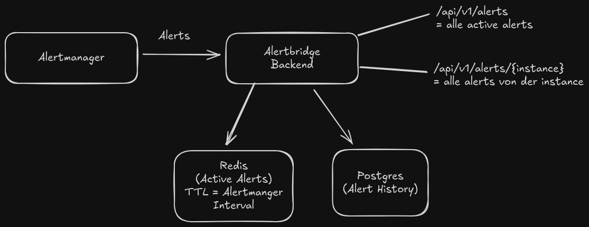

# Problem
Der Alertmanager liefert viele Daten, aber es ist schwer, daraus eine schnelle und übersichtliche Darstellung aller Server und ihrer aktuellen Alerts zu bekommen.

# Idee 
Die Idee ist, eine schnelle und übersichtliche Darstellung aller Alerts zu ermöglichen. 
Der Alertmanager soll in einem definierten Intervall aktuelle Alerts an das Backend senden. 
Das Backend nimmt diese entgegen und speichert sie in Redis, um die aktiven Alerts schnell abrufen zu können, 
sowie in PostgreSQL, um eine Historie aufzubauen.

Über ein Frontend soll es möglich sein, eine schnelle Übersicht der Server und deren Anzahl an Alerts zu erhalten. 
Zusätzlich soll eine Detailansicht pro Server verfügbar sein, die sowohl die aktuellen als auch die historischen Alerts darstellt.

# Ziel
## Backend
Das Backend empfängt die Alerts in einem definierten Intervall und speichert sie:
- Redis für die aktuellen, aktiven Alerts
- PostgreSQL für die vollständige Historie der Alerts

## Frontend
Das Frontend soll:
- eine übersichtliche Anzeige aller Server mit der Anzahl der aktiven Alerts ermöglichen
- eine Detailansicht pro Server bieten, die sowohl aktive als auch historische Alerts zeigt

## Deployment
Das Backend und das Frontend sollen in Containern mit Docker bereitgestellt werden können.
Die Konfiguration soll über Umgebungsvariablen (Environment Variables) flexibel anpassbar sein, 
sodass das System einfach in unterschiedlichen Umgebungen betrieben werden kann.

# Architektur / Techstack

## Backend
- Golang
- Redis
- Postgres

# API

- POST /api/v1/alertmanager = Endpunkt für den Alertmanager Webhook
- GET  /api/v1/alerts = alle activen Alerts
- GET  /api/v1/alerts/{instance} = alle Alerts der Instanz

# Tests
Die Tests des Backends können aktuell im backend-Verzeichnis ausgeführt werden.

- Unit Tests: `make test-unit`
- Integration Tests: `make test`

Die Makefile übernimmt dabei die Ausführung und sorgt dafür, dass alle Tests korrekt gestartet werden.
